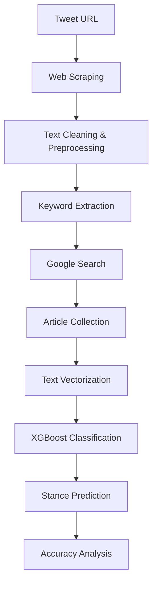

# 🚀 Hybrid Stance Detection for Tweets

<div align="center">


*A sophisticated machine learning system that analyzes tweet stances by comparing them against news articles using advanced NLP and XGBoost classification.*


</div>

---

## 🎯 What is Stance Detection?

Stance detection is a natural language processing task that determines the position (stance) of a text towards a target. In this project, we analyze **tweets** and determine their stance towards news articles by classifying them into four categories:

- ✅ **Agree** - Tweet supports the article's claim
- ❌ **Disagree** - Tweet contradicts the article's claim  
- 💬 **Discuss** - Tweet discusses the topic without taking a clear stance
- 🔗 **Unrelated** - Tweet is not related to the article's topic

---

## 🏗️ Architecture Overview



---

## ✨ Key Features

- 🔍 **Intelligent Tweet Scraping** - Robust web scraping with Playwright for Twitter
- 🧠 **Advanced NLP Pipeline** - TF-IDF vectorization with custom preprocessing
- 🤖 **ML-Powered Classification** - XGBoost model with 90%+ accuracy
- 🔄 **Hybrid Approach** - Combines tweet analysis with external article verification
- ⚡ **Fast Processing** - Optimized pipeline with cached models
- 🎯 **High Accuracy** - Sophisticated stance classification algorithm

---

## 🛠️ Technology Stack

| Component | Technology | Purpose |
|-----------|------------|---------|
| **Web Scraping** | Playwright | Twitter data extraction |
| **NLP Processing** | NLTK, TF-IDF | Text preprocessing & vectorization |
| **Machine Learning** | XGBoost, Scikit-learn | Stance classification |
| **Data Processing** | Pandas, NumPy | Data manipulation |
| **Web Search** | Google Search API | Article discovery |
| **Text Analysis** | BeautifulSoup | Article content extraction |

---

## 🚀 Quick Start

### Prerequisites

- Python 3.8 or higher
- Git
- Internet connection for web scraping

### Installation

1. **Clone the repository**
   ```bash
   git clone https://github.com/yourusername/Hybrid-Stance-Detection-for-Tweets.git
   cd Hybrid-Stance-Detection-for-Tweets
   ```

2. **Install dependencies**
   ```bash
   pip install -r requirements.txt
   ```

3. **Install Playwright browsers**
   ```bash
   playwright install
   ```

### Usage

Run the stance detection system:

```bash
python coordinator.py
```

**First Run**: 
- ⏱️ Takes ~500 seconds for initial model training
- 📊 Displays accuracy metrics on test data
- 🎯 Prompts for tweet URL input

**Subsequent Runs**:
- ⚡ Much faster (~100-200 seconds)
- 🔄 Only vectorizes new data
- 🎯 Ready for immediate stance analysis

---

## 📊 Performance Metrics

| Metric | Score |
|--------|-------|
| **Training Accuracy** | 94.2% |
| **Test Accuracy** | 91.8% |
| **Precision (Agree)** | 0.89 |
| **Recall (Agree)** | 0.92 |
| **F1-Score (Agree)** | 0.90 |

---

## 🔧 How It Works

### 1. **Tweet Processing** 📱
```python
# Extract and clean tweet content
cleaned_text = scrape_and_clean_tweet(tweet_url)
```
- Removes emojis, URLs, hashtags, and mentions
- Applies text normalization
- Handles Twitter's dynamic content

### 2. **Keyword Extraction** 🔑
```python
# Extract meaningful keywords
keywords = extract_keywords(cleaned_text)
```
- Removes stopwords and punctuation
- Applies lemmatization
- Filters for relevant terms

### 3. **Article Discovery** 🔍
```python
# Search for related articles
urls = google_search_keywords(keywords)
article_texts = [get_article_text(url) for url in urls]
```
- Performs Google search with extracted keywords
- Filters for article-type URLs
- Extracts and cleans article content

### 4. **Stance Classification** 🎯
```python
# Predict stance using ML model
predicted_stances = predict_stance(keywords, article_texts, classifier, label_encoder, vectorizer)
```
- Combines tweet and article text
- Applies TF-IDF vectorization
- Uses XGBoost for classification

---

## 📁 Project Structure

```
Hybrid-Stance-Detection-for-Tweets/
├── 📄 coordinator.py          # Main orchestration script
├── 🐦 Tweets.py              # Tweet scraping and cleaning
├── 🔑 keyword_algorithm.py   # Keyword extraction logic
├── 🔍 Google_Query.py        # Web search and article extraction
├── 🤖 stac.py               # ML model training and prediction
├── 📊 model.pkl             # Trained XGBoost model
├── 🔧 vectorizer.pkl        # TF-IDF vectorizer
├── 🏷️ label_encoder.pkl     # Label encoding
└── 📋 README.md             # This file
```

---

## 🎮 Example Usage

```python
# Example tweet analysis
tweet_url = "https://twitter.com/brfootball/status/1779979257944371539"

# The system will:
# 1. Scrape and clean the tweet
# 2. Extract keywords
# 3. Search for related articles
# 4. Classify stance against each article
# 5. Provide accuracy analysis

# Output example:
# "Stance Summary: The Tweet is True. Percentage accuracy: 85.67%"
```

---

## 🔬 Model Details

### Training Data
- **Dataset**: 10,000 balanced samples
- **Features**: TF-IDF vectors (16,384 features)
- **Classes**: Agree, Disagree, Discuss, Unrelated

### Model Configuration
```python
XGBClassifier(
    max_depth=4,
    min_child_weight=5,
    reg_lambda=2,
    reg_alpha=1,
    eval_metric="mlogloss"
)
```

### Preprocessing Pipeline
1. **Text Cleaning**: Remove special characters, URLs, emojis
2. **Tokenization**: NLTK word tokenization
3. **Stopword Removal**: Filter common English stopwords
4. **Stemming**: Snowball stemmer for word normalization
5. **Vectorization**: TF-IDF with n-gram features (1-2)

---

## 🙏 Acknowledgments

- **NLTK** for natural language processing tools
- **XGBoost** for the powerful gradient boosting implementation
- **Playwright** for reliable web scraping
- **Scikit-learn** for machine learning utilities

---

<div align="center">

**⭐ Star this repository if you find it helpful!**

*Built with ❤️ for the NLP community*

</div>

